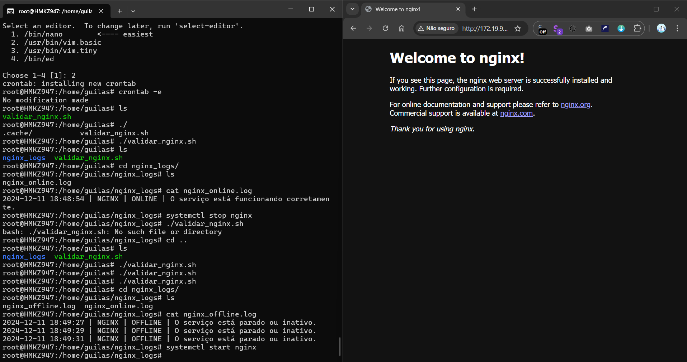

# **Atividade no Linux: Instalação e Validação do Nginx**

## **Objetivo**

- Instalar e configurar o servidor **Nginx**.  
- Criar um **script de validação** que verifica o status do serviço e gera logs separados para **ONLINE** e **OFFLINE**.  
- Automatizar a execução do script a cada **5 minutos** usando **cron**.  
- Versionar o projeto com **Git**.  

---

## **1. Pré-requisitos**

Antes de iniciar, verifique se o sistema está preparado:

1. **Sistema Operacional**: Ubuntu 20.04 ou superior (pode ser uma VM, WSL ou servidor físico).  
2. **Permissões de administrador** (usuário com acesso `sudo`).  
3. **Git** instalado.  

### **Instalar o Git (caso não esteja presente)**

```bash
sudo apt update -y
sudo apt install git -y
```

## **2.Instalação do Servidor Nginx**

### Atualize o sistema:

```bash
sudo apt update -y && sudo apt upgrade -y
```

### Instale o Nginx:

```bash
sudo apt install nginx -y
```

### Inicie e habilite o Nginx:

```bash
sudo systemctl start nginx
sudo systemctl enable nginx
```

A saída deve mostrar que o serviço está active (running).

Teste no navegador: Abra o navegador e acesse:

```bash
http://<IP_DO_SERVIDOR>
```

## **3.Criando o Script de Validação do Nginx**

Crie o diretório de scripts (se não existir):

```bash
mkdir -p ~/scripts
```

Crie o script validar_nginx.sh no diretório ~/scripts:

```bash
nano ~/scripts/validar_nginx.sh
```

Cole o conteúdo abaixo no editor:

```bash
#!/bin/bash
LOG_DIR="/home/guilas/nginx_logs"; mkdir -p "$LOG_DIR"
STATUS=$(systemctl is-active nginx)
[ "$STATUS" = "active" ] && echo "$(date '+%Y-%m-%d %H:%M:%S') | NGINX | ONLINE | O serviço está funcionando corretamente." >> "$LOG_DIR/nginx_ONLINE.log" || echo "$(date '+%Y-%m-%d %H:%M:%S') | NGINX | OFFLINE | O serviço está parado ou inativo." >> "$LOG_DIR/nginx_OFFLINE.log"
```

Salvar e sair do editor (Ctrl + O e Ctrl + X no Nano).

Torne o script executável:

```
chmod +x ~/scripts/validar_nginx.sh
```

Execute o script manualmente para testar:

```
~/scripts/validar_nginx.sh
```


Verifique os logs gerados:

```
cat ~/nginx_logs/nginx_online.log
cat ~/nginx_logs/nginx_offline.log
```


## **4.Automação do Script com Cron**

Abra o agendador de tarefas do cron:

```
crontab -e
```

Adicione a linha abaixo para executar o script a cada 5 minutos:

```
*/5 * * * * /home/<SEU_USUARIO>/scripts/validar_nginx.sh
```

Substitua <SEU_USUARIO> pelo seu nome de usuário.

Salvar e sair (Ctrl + O e Ctrl + X no Nano).

Verifique se o cron está configurado corretamente:

```
crontab -l
```

## **5.Versionamento do Projeto com Git**


Navegue até o diretório onde está o script:

```
cd ~/scripts
```

Inicialize o repositório Git:

```
git init
```

Adicione os arquivos ao Git:


```
git add validar_nginx.sh
```


Faça o primeiro commit:

```
git commit -m "Adiciona script de validação do Nginx"

```

Adicione um repositório remoto (exemplo: GitHub):

```
git remote add origin <URL_DO_REPOSITORIO>
```

Envie os arquivos para o repositório:


```
git push -u origin main
```


## **6.Estrutura Final do Projeto**

Após concluir as etapas, a estrutura dos arquivos será:

```
~/nginx_logs/                # Diretório para os logs
│   ├── nginx_online.log     # Logs do Nginx ONLINE
│   └── nginx_offline.log    # Logs do Nginx OFFLINE
│
~/scripts/
│   └── validar_nginx.sh     # Script de validação do Nginx
│
~/.git/                      # Repositório Git versionado
```

## **7.Validação do Projeto**

Validar o Nginx:

Acesse no navegador:

```
http://<IP_DO_SERVIDOR>
```

Validar logs:
Confira se os arquivos estão sendo atualizados:

```
tail -f ~/nginx_logs/nginx_online.log
tail -f ~/nginx_logs/nginx_offline.log
```

</br>


## **8.Comprovação da Atividade**




<br>